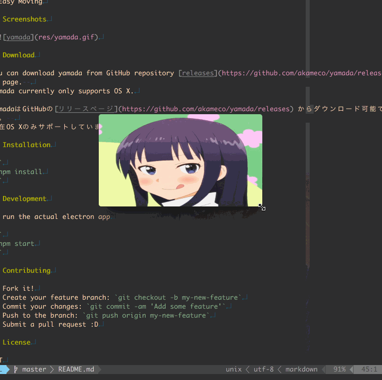

# yamada

[](https://greenkeeper.io/)


> ミニマム作業用画像ビューア

## 特徴

- お気に入りの画像フォルダをスライドショー
- 最前面に表示可能
- フレームレスウィンドウ
- ドラックで簡単に移動
- CUIから起動

## スクリーンショット

# 


## ダウンロード

### MacOS

[Download](https://github.com/akameco/yamada/releases)

ダウンロード後、zipを展開し`/Applications`に配置してください。

## CLI

CLIをサポートしています。
ターミナルから現在のディレクトリを簡単に開くことができます。

```
$ yamada --help

  Usage
    $ yamada [path]

  Options
    --interval,-i    interval time

  Examples
    $ yamada . -i 3000
    $ yamada ~/Pictures/
```

## Contributing

1. Fork it!
2. Create your feature branch: `git checkout -b my-new-feature`
3. Commit your changes: `git commit -am 'Add some feature'`
4. Push to the branch: `git push origin my-new-feature`
5. Submit a pull request :D

## License

MIT © [akameco](http://akameco.github.io)
