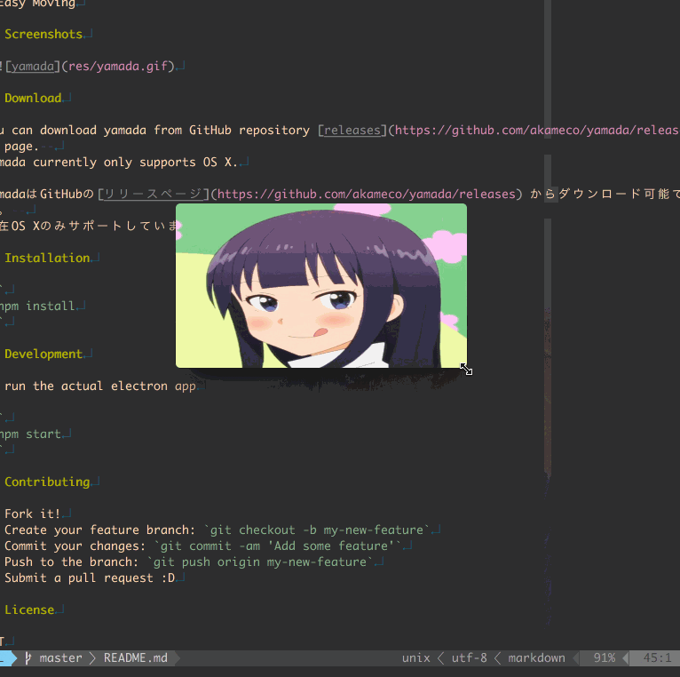

# 

> ミニマム作業用画像ビューア

## 特徴

- Slideshow of your favorite images
- Always on Top
- No Title bar
- Easy Moving
- CLI Support

## Screenshots

# 


## Download

### OSX

[Download](https://github.com/akameco/yamada/releases)

ダウンロード後、zipを展開し`/Applications`に配置してください。

## CLI

CLIをサポートしています。
ターミナルから現在のディレクトリを簡単に開くことができます。

```
$ yamada .
```

### ヘルプ

```
$ yamada -h
```

## Development

```
$ npm start
```

## Contributing

1. Fork it!
2. Create your feature branch: `git checkout -b my-new-feature`
3. Commit your changes: `git commit -am 'Add some feature'`
4. Push to the branch: `git push origin my-new-feature`
5. Submit a pull request :D

## License

MIT
